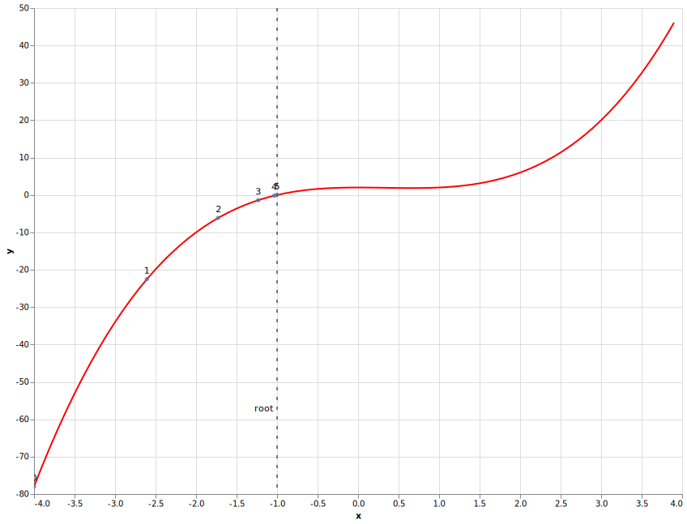

# Show me the visualization

Running C++ code in a web browser is all nice, but we really want to grab someones attention by visualizing something. In this blog we are going to make a plot from the results coming from our C++ code.

To make a plot we need some data. In a [previous](TODO fix url ../js-webapp) post we found the root of an equation using the Newton-Raphson algorithm implemented in C++ and compiled to a WebAsssembly module.
A single root value makes for a depressing plot. The Newton-Raphson algorithm uses iterations to find the root so we will capture the data of each iteration and plot those.

Let's make changes to the C++ code to retrieve the data from the iterations.

## Iterations

We will add `iterations` public property to the NewtonRaphson which is a vector of iteration structs. So the `newtonraphson.hpp` becomes

```cpp
#ifndef H_NEWTONRAPHSON_H
#define H_NEWTONRAPHSON_H

#include <vector>

struct Iteration {
  int index;
  double x;
  double y;
  double slope;
  double delta_x;
};

class NewtonRaphson {
  public:
    NewtonRaphson(double tolerancein);
    double solve(double xin);
    std::vector<Iteration> iterations;
  private:
    double tolerance;
};
#endif
```
File: _newtonraphson.hpp_

The `newtonraphson.cpp` is rewritten from a while loop to a do while loop like with a push to the iterations vector each cycle.

```cpp
#include "newtonraphson.hpp"
#include "algebra.cpp"
#include <math.h>

// Define the constructor method of NewtonRaphson instances
NewtonRaphson::NewtonRaphson(double tolerancein) : tolerance(tolerancein) {}

// Define the 'solve' method of NewtonRaphson instances
double NewtonRaphson::solve(double initial_guess) {
  double x = initial_guess;
  double delta_x = 0.0;
  int i = 0;
  do {
    delta_x = equation(x) / derivative(x);
    iterations.push_back({i++, x, equation(x), derivative(x), delta_x});
    x = x - delta_x;
  } while (fabs(delta_x) >= tolerance);
  return x;
};
```
File: _newtonraphson.cpp_.

Before we go into Emscripten world, lets first test our c++ code. We will check if the iteration property is actually populated correctly by wrapping the code in a main function, adding some print statements, compiling it and running it.

```cpp
#include <iomanip>
#include <iostream>

#include "newtonraphson.hpp"

int main() {
  double initial_guess = -4;
  double tolerance = 0.001;
  NewtonRaphson newtonraphson(tolerance);
  newtonraphson.solve(initial_guess);

  std::cout << std::fixed;
  std::cout << std::setprecision(2);

  for (Iteration iteration : newtonraphson.iterations) {
    std::cout << "index = " << iteration.index;
    std::cout << " x = " << iteration.x;
    std::cout << " y = " << iteration.y;
    std::cout << " slope = " << iteration.slope;
    std::cout << " delta_x = " << iteration.delta_x << std::endl;
  }
  return 0;
}
```
File: _cli.cpp_.

Compile it with

```shell
c++ -o cli.exe newtonraphson.cpp cli.cpp
```

Run with

```shell
./cli.exe
i = 0 x = -4.00 y = -78.00 slope = 56.00 delta_x = -1.39
i = 1 x = -2.61 y = -22.52 slope = 25.61 delta_x = -0.88
i = 2 x = -1.73 y = -6.14 slope = 12.41 delta_x = -0.49
i = 3 x = -1.23 y = -1.39 slope = 7.02 delta_x = -0.20
i = 4 x = -1.03 y = -0.18 slope = 5.28 delta_x = -0.03
i = 5 x = -1.00 y = -0.00 slope = 5.01 delta_x = -0.00
```

The last iteration has `-1.00` as x, which is what we expected.

## Bindings

Emscripten can handle simple types like double and int, but needs help exposing more complex types to JavaScript like the iterations property.
We need to use [value_object](https://emscripten.org/docs/porting/connecting_cpp_and_javascript/embind.html#value-types) to expose the Iteration struct and [register_vector](https://emscripten.org/docs/porting/connecting_cpp_and_javascript/embind.html#built-in-type-conversions) as the iterations property type.

So the bindings look like

```cpp
#include <emscripten/bind.h>
#include "newtonraphson.hpp"

using namespace emscripten;

EMSCRIPTEN_BINDINGS(newtonraphson) {
  class_<NewtonRaphson>("NewtonRaphson")
    .constructor<double>()
    .function("solve", &NewtonRaphson::solve)
    .property("iterations", &NewtonRaphson::iterations)
    ;

  value_object<Iteration>("Iteration")
    .field("index", &Iteration::index)
    .field("x", &Iteration::x)
    .field("y", &Iteration::y)
    .field("slope", &Iteration::slope)
    .field("delta_x", &Iteration::delta_x)
    ;

  register_vector<Iteration>("vector<Iteration>");
}

```
File: _bindings.cpp_.

Same as in previous blog we can compile to a WebAssembly module with Emscripten using `emcc` command

```shell
emcc \
  -I. \
  -o newtonraphson.js \
  -Oz \
  -s MODULARIZE=1 \
  -s EXPORT_NAME=createModule \
  --bind newtonraphson.cpp bindings.cpp

```

## Vega-lite decleration

TODO Introduce Vega

TODO explain vega-spec.json layer construction

```html
<html>
  <head>
    <script type="text/javascript" src="newtonraphson.js"></script>
    <script src="https://cdn.jsdelivr.net/npm/vega@5.13.0"></script>
    <script src="https://cdn.jsdelivr.net/npm/vega-lite@4.13.0"></script>
    <script src="https://cdn.jsdelivr.net/npm/vega-embed@6.8.0"></script>
  </head>
  <body>
    <div id="plot"></div>
    <script>
      createModule().then(async (rootfinding) => {
        const tolerance = 0.001;
        const initial_guess = -4;
        const newtonraphson = new rootfinding.NewtonRaphson(tolerance);
        newtonraphson.solve(initial_guess);
        // newtonraphson.iterations is a vector object which not consumeable by Vega
        // So convert Emscripten vector of objects to JavaScript array of objects
        const iterations = new Array(
            newtonraphson.iterations.size()
        ).fill().map(
          (_, iteration) => {
            return newtonraphson.iterations.get(iteration)
          }
        );
        // Open console in DevTools (F12) to see iterations data as a JSON string
        console.log(JSON.stringify(iterations, null, 2));
        // Read vega-lite declaration
        const spec_request = await fetch('vega-spec.json');
        // TODO decide for spec to be fetched and overwrites or fetched or inlined
        const spec = await spec_request.json();
        // ovewrite equation range
        spec.layer[0].data.sequence.start = initial_guess;
        spec.layer[0].data.sequence.stop = -1 * initial_guess;
        // overwrite data
        spec.layer[2].data.values = iterations;
        vegaEmbed(document.getElementById("plot"), spec);
      });
    </script>
  </body>
</html>

```
File: _index.html.

When we visit the web page, we will be greeted by the following plot. We can zoom with mouse wheel and pan by dragging. Also when we hover over a point we get a tooltip with all iteration data.

[](https://nlesc-jcer.github.io/run-cpp-on-web/js-plot/index.html)
(Click on image to get interactive version)
TODO see if interactive version can be embedded
