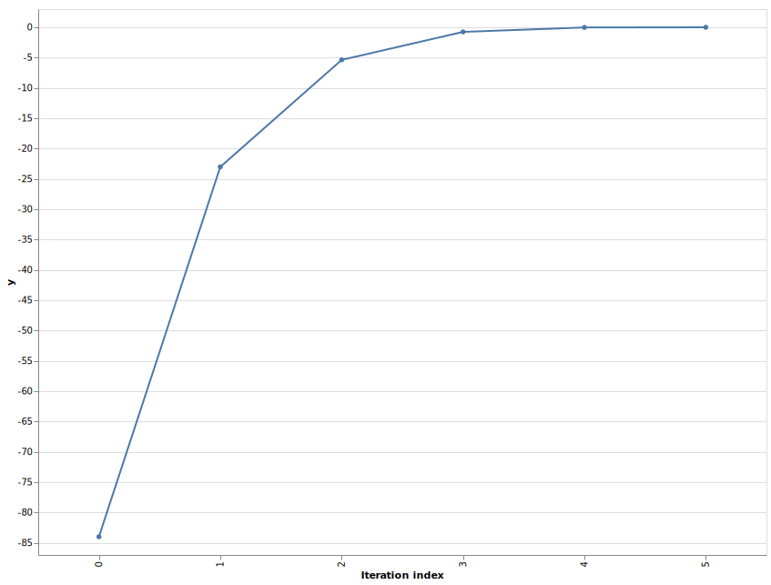
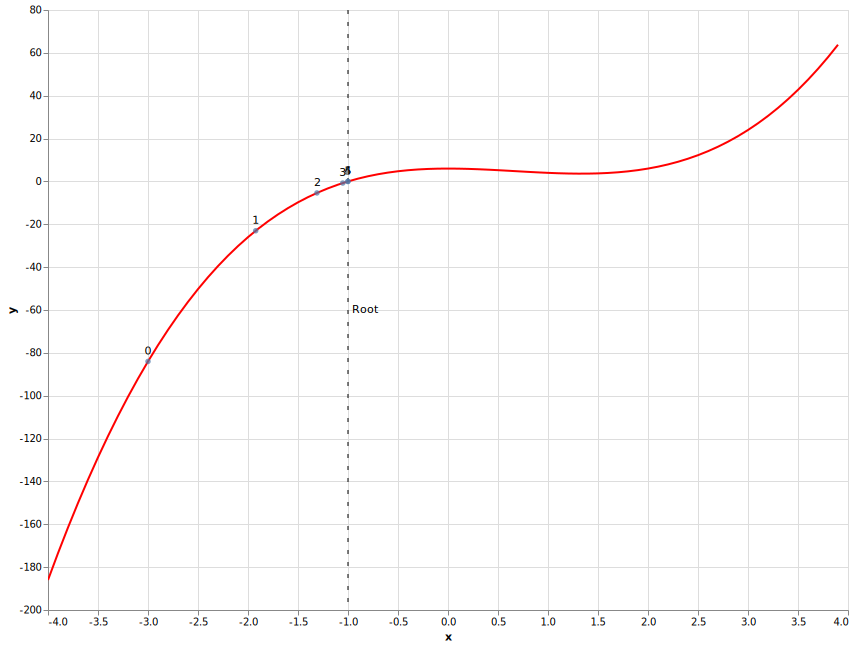

# Show me the visualization

Running C++ code in a web browser is all nice, but we really want to grab someones attention by visualizing something. In this blog we are going to make a plot from the results coming from our C++ code.

To make a plot we need some data. In a [previous](TODO fix url ../js-webapp) post we found the root of an equation using the Newton-Raphson algorithm implemented in C++ and compiled to a WebAsssembly module.
A single root value makes for a depressing plot. The Newton-Raphson algorithm uses iterations to find the root so we will capture the data of each iteration and plot those.

Let's make changes to the C++ code to store the data from the iterations.

## Iterations

To store data of an iteration we will use a structure with the following variables:

* x, x value, starts with initial guess and ends with root result
* y, result of passing x through equation
* slope, slope or derivative at value x
* delta_x, y divided by slope

We will add `iterations` public property to the NewtonRaphson which is a vector of iteration structs. So the `newtonraphson.hpp` becomes

```cpp
#ifndef H_NEWTONRAPHSON_H
#define H_NEWTONRAPHSON_H

#include <vector>

struct Iteration {
  int index;
  double x;
  double y;
  double slope;
  double delta_x;
};

class NewtonRaphson {
  public:
    NewtonRaphson(double tolerance_in);
    double solve(double initial_guess);
    std::vector<Iteration> iterations;
  private:
    double tolerance;
};
#endif
```
File: _newtonraphson.hpp_

The `newtonraphson.cpp` is rewritten from a while loop to a do while loop like with a push to the iterations vector each cycle.

```cpp
#include "newtonraphson.hpp"
#include "algebra.cpp"
#include <math.h>

// Define the constructor method of NewtonRaphson instances
NewtonRaphson::NewtonRaphson(double tolerance_in) : tolerance(tolerance_in) {}

// Define the 'solve' method of NewtonRaphson instances
double NewtonRaphson::solve(double initial_guess) {
  double x = initial_guess;
  double delta_x = 0.0;
  int i = 0;
  do {
    delta_x = equation(x) / derivative(x);
    iterations.push_back({i++, x, equation(x), derivative(x), delta_x});
    x = x - delta_x;
  } while (fabs(delta_x) >= tolerance);
  return x;
};
```
File: _newtonraphson.cpp_.

Before we go into Emscripten world, lets first test our c++ code. We will check if the iteration property is actually populated correctly by wrapping the code in a main function, adding some print statements, compiling it and running it.

```cpp
#include <iostream>
#include <iomanip>

#include "newtonraphson.hpp"

int main() {
  double initial_guess = -3;
  double tolerance = 0.001;
  NewtonRaphson newtonraphson(tolerance);
  newtonraphson.solve(initial_guess);

  std::cout << std::fixed;
  std::cout << std::setprecision(2);

  for (Iteration iteration : newtonraphson.iterations) {
    std::cout << "index = " << iteration.index;
    std::cout << " x = " << iteration.x;
    std::cout << " y = " << iteration.y;
    std::cout << " slope = " << iteration.slope;
    std::cout << " delta_x = " << iteration.delta_x << std::endl;
  }
  return 0;
}
```
File: _cli.cpp_.

Compile it with

```shell
g++ -o cli.exe newtonraphson.cpp cli.cpp
```

Run with

```shell
./cli.exe
index = 0 x = -3.00 y = -84.00 slope = 78.00 delta_x = -1.08
index = 1 x = -1.92 y = -23.02 slope = 37.57 delta_x = -0.61
index = 2 x = -1.31 y = -5.37 slope = 20.79 delta_x = -0.26
index = 3 x = -1.05 y = -0.76 slope = 15.06 delta_x = -0.05
index = 4 x = -1.00 y = -0.03 slope = 14.04 delta_x = -0.00
index = 5 x = -1.00 y = -0.00 slope = 14.00 delta_x = -0.00
```

The last iteration has `-1.00` as x, which is what we expected.

## Bindings

Emscripten can handle simple types like double and int, but needs help exposing more complex types to JavaScript like the iterations property.
We need to use [value_object](https://emscripten.org/docs/porting/connecting_cpp_and_javascript/embind.html#value-types) to expose the Iteration struct and [register_vector](https://emscripten.org/docs/porting/connecting_cpp_and_javascript/embind.html#built-in-type-conversions) as the iterations property type.

So the bindings look like

```cpp
#include <emscripten/bind.h>
#include "newtonraphson.hpp"

using namespace emscripten;

EMSCRIPTEN_BINDINGS(newtonraphson) {
  class_<NewtonRaphson>("NewtonRaphson")
    .constructor<double>()
    .function("solve", &NewtonRaphson::solve)
    .property("iterations", &NewtonRaphson::iterations)
    ;

  value_object<Iteration>("Iteration")
    .field("index", &Iteration::index)
    .field("x", &Iteration::x)
    .field("y", &Iteration::y)
    .field("slope", &Iteration::slope)
    .field("delta_x", &Iteration::delta_x)
    ;

  register_vector<Iteration>("vector<Iteration>");
}
```
File: _bindings.cpp_.

Same as in previous blog we can compile to a WebAssembly module with Emscripten using `emcc` command

```shell
emcc -I. -o newtonraphson.js -Oz -s MODULARIZE=1 \
  -s EXPORT_NAME=createModule --bind newtonraphson.cpp bindings.cpp
```

To get the iteration data in JavaScript we use the following code

```javascript
const initial_guess = -3;
const tolerance = 0.001;
const newtonraphson = new rootfinding.NewtonRaphson(tolerance);
newtonraphson.solve(initial_guess);
// newtonraphson.iterations is a vector object which not consumeable by Vega
// So convert Emscripten vector of objects to JavaScript array of objects
const iterations = new Array(
    newtonraphson.iterations.size()
).fill().map(
  (_, iteration) => {
    return newtonraphson.iterations.get(iteration)
  }
);
```

Let's have a look at the data we want to plot, by logging it to the web browsers DevTools (press F12 to open) with `console.log(JSON.stringify(iterations))` to get

```json
[
  {
    "index": 0,
    "x": -3,
    "y": -84,
    "slope": 78,
    "delta_x": -1.0769230769230769
  },
  {
    "index": 1,
    "x": -1.9230769230769231,
    "y": -23.01684114701866,
    "slope": 37.57396449704142,
    "delta_x": -0.6125741974560871
  },
  {
    "index": 2,
    "x": -1.310502725620836,
    "y": -5.371029926801942,
    "slope": 20.788526168124527,
    "delta_x": -0.25836511368648407
  },
  {
    "index": 3,
    "x": -1.0521376119343517,
    "y": -0.7573933273926876,
    "slope": 15.059062222156337,
    "delta_x": -0.050294853439036724
  },
  {
    "index": 4,
    "x": -1.001842758495315,
    "y": -0.025832589038255804,
    "slope": 14.03687554445953,
    "delta_x": -0.0018403375421001107
  },
  {
    "index": 5,
    "x": -1.0000024209532148,
    "y": -0.00003389340361792392,
    "slope": 14.00004841909946,
    "delta_x": -0.0000024209490284108664
  }
]
```

## Vega-Lite specification

There [many ways to do visualizations](https://github.com/sorrycc/awesome-javascript#data-visualization) on the web. My personal favorite at the moment is [Vega-Lite](https://vega.github.io/vega-lite/), so we will use it here.
Vega-Lite is a JavaScript library which describes a plot using a JSON document. In Vega-Lite the JSON Document is called a specification and can be rendered to an interactive visualization.

 The root finding algorithm tries to find the x where y is zero.
 So let's plot the iteration index against the y found in each iteration to see how quickly it converged to an answer.

 The specification is constructed out the following blocks

 * data, the iterations we want to plot as an array of iteration objects
 * mark, for scatter plot this is a [circle](https://vega.github.io/vega-lite/docs/circle.html)
 * encoding, which field should go on which axis

```js
const spec = {
  "$schema": "https://vega.github.io/schema/vega-lite/v4.json",
  "width": 800,
  "height": 600,
  "data": {
    "values": iterations
  },
  "encoding": {
    "x": {"field": "index", "type": "ordinal"},
    "y": {"field": "y", "type": "quantitative"}
  },
  "mark": {
    "type": "circle",
    // Enable tooltip so on mouseover it shows all data of that iteration
    "tooltip": {"content": "data"}
  },
  // Enable zooming and panning
  "selection": {"grid": {"type": "interval", "bind": "scales"}}
};
```

To render a specification we need to use the `vegaEmbed(element, spec)` method which accepts a HTML element and a Vega-Lite specification.

```html
<html>
  <head>
    <script type="text/javascript" src="newtonraphson.js"></script>
    <script src="https://cdn.jsdelivr.net/npm/vega@5.13.0"></script>
    <script src="https://cdn.jsdelivr.net/npm/vega-lite@4.13.0"></script>
    <script src="https://cdn.jsdelivr.net/npm/vega-embed@6.8.0"></script>
  </head>
  <body>
    <div id="plot"></div>
    <script>
      ...
      vegaEmbed(document.getElementById("plot"), spec);
    </script>
  </body>
</html>
```

The complete HTML pages looks like

```html
<html>
  <head>
    <script type="text/javascript" src="newtonraphson.js"></script>
    <script src="https://cdn.jsdelivr.net/npm/vega@5.13.0"></script>
    <script src="https://cdn.jsdelivr.net/npm/vega-lite@4.13.0"></script>
    <script src="https://cdn.jsdelivr.net/npm/vega-embed@6.8.0"></script>
  </head>
  <body>
    <div id="plot"></div>
    <script>
      createModule().then((rootfinding) => {
        const initial_guess = -3;
        const tolerance = 0.001;
        const newtonraphson = new rootfinding.NewtonRaphson(tolerance);
        newtonraphson.solve(initial_guess);
        // newtonraphson.iterations is a vector object which not consumeable by Vega
        // So convert Emscripten vector of objects to JavaScript array of objects
        const iterations = new Array(
            newtonraphson.iterations.size()
        ).fill().map(
          (_, iteration) => {
            return newtonraphson.iterations.get(iteration)
          }
        );
        // Open console in DevTools (F12) to see iterations data as a JSON string
        console.log(JSON.stringify(iterations, null, 2));
        const spec = {
          "$schema": "https://vega.github.io/schema/vega-lite/v4.json",
          "width": 800,
          "height": 600,
          "data": {
            "values": iterations
          },
          "encoding": {
            "x": {"field": "index", "type": "ordinal", "title": "Iteration index"},
            "y": {"field": "y", "type": "quantitative"}
          },
          "mark": {
            "type": "circle",
            // Enable tooltip so on mouseover it shows all data of that iteration
            "tooltip": {"content": "data"}
          },
          // Enable zooming and panning
          "selection": {"grid": {"type": "interval", "bind": "scales"}}
        };
        vegaEmbed(document.getElementById("plot"), spec);
      });
    </script>
  </body>
</html>
```
File: _scatter.html.

We'll need a web server to display the HTML page in a web browser. For this, we'll use the http.server module from Python 3 to host all files on port 8000, like so:

```shell
python3 -m http.server 8000
```

When we visit the web page at [http://localhost:8000/scatter.html](http://localhost:8000/scatter.html), we will be greeted by the following plot. We can zoom with mouse wheel and pan by dragging. Also when we hover over a point we get a tooltip with all iteration data.

[](https://nlesc-jcer.github.io/run-cpp-on-web/js-plot/scatter.html)
(Click on image to get interactive version)
TODO see if interactive version can be embedded

## Advanced plot

In the first blog of this series we plotted the equation and root as


It would be nice to write a specification of this plot together with the iterations the root finding algorithm went through.
Vega-Lite can superimpose one chart on top of another with [layers](https://vega.github.io/vega-lite/docs/layer.html) keyword.
Let's construct each layer separately and super impose them at the end.

The 2x^3 - 4x^2 + 6 equation is plotted by using a [sequence generator](https://vega.github.io/vega-lite/docs/data.html#sequence) and a [formula transform](https://vega.github.io/vega-lite/docs/calculate.html).

```js
const equation_line = {
  "data": {"sequence": {"start": -4, "stop": 4, "step": 0.1, "as": "x"}},
  "transform": [
    {
      "calculate": "2 * datum.x * datum.x * datum.x - 4 * datum.x * datum.x + 6",
      "as": "y"
    }
  ],
  "mark": "line",
  "encoding": {
    "x": {"type": "quantitative", "field": "x"},
    "y": {"field": "y", "type": "quantitative"},
    "color": {"value": "#f00"}
  }
};
```

To show where the root is we draw a dotted vertical line at x is -1 with an title. For the ruler and title we reuse the data via layers and use a [rule marker](https://vega.github.io/vega-lite/docs/rule.html) and [text marker](https://vega.github.io/vega-lite/docs/text.html) respectivly.

```js
const root_rule = {
  "data": {"values": [{"x": -1}]},
  "encoding": {"x": {"field": "x", "type": "quantitative"}},
  "layer": [
    {"mark": {"type": "rule", "strokeDash": [4, 8]}},
    {"mark": {"type": "text", "align": "left", "dx": 4, "text": "Root"}}
  ]
};
```

When we plot the x and y of each iteration we can no longer see the order of iterations.
So we will use a text marker above each circle to tell us to which iteration it belongs.

```js
const iterations_scatter = {
  "data": {
    "values": iterations
  },
  "encoding": {
    "x": {"field": "x", "type": "quantitative"},
    "y": {"field": "y", "type": "quantitative"},
    "text": {"field": "index", "type": "nominal"}
  },
  "layer": [
    {
      "mark": {"type": "circle", "tooltip": {"content": "data"}},
      "selection": {"grid": {"type": "interval", "bind": "scales"}}
    },
    {"mark": {"type": "text", "dy": -10}}
  ]
};
```

Superimpose the equation, root ruler and iteration plot into a single visualization with

```js
const spec = {
  "$schema": "https://vega.github.io/schema/vega-lite/v4.json",
  "width": 800,
  "height": 600,
  "layer": [
    equation_line,
    root_rule,
    iterations_scatter
  ]
};
```

The HTML page with all JavaScript put together to make a composite plot is

```html
<html>

<head>
  <script type="text/javascript" src="newtonraphson.js"></script>
  <script src="https://cdn.jsdelivr.net/npm/vega@5.13.0"></script>
  <script src="https://cdn.jsdelivr.net/npm/vega-lite@4.13.0"></script>
  <script src="https://cdn.jsdelivr.net/npm/vega-embed@6.8.0"></script>
</head>

<body>
  <div id="plot"></div>
  <script>
    createModule().then((rootfinding) => {
      const initial_guess = -3;
      const tolerance = 0.001;
      const newtonraphson = new rootfinding.NewtonRaphson(tolerance);
      newtonraphson.solve(initial_guess);
      // newtonraphson.iterations is a vector object which not consumeable by Vega
      // So convert Emscripten vector of objects to JavaScript array of objects
      const iterations = new Array(
        newtonraphson.iterations.size()
      ).fill().map(
        (_, iteration) => {
          return newtonraphson.iterations.get(iteration)
        }
      );
      // Open console in DevTools (F12) to see iterations data as a JSON string
      console.log(JSON.stringify(iterations, null, 2));
      const equation_line = {
        "data": { "sequence": { "start": -4, "stop": 4, "step": 0.1, "as": "x" } },
        "transform": [
          {
            "calculate": "2 * datum.x * datum.x * datum.x - 4 * datum.x * datum.x + 6",
            "as": "y"
          }
        ],
        "mark": "line",
        "encoding": {
          "x": { "type": "quantitative", "field": "x" },
          "y": { "field": "y", "type": "quantitative" },
          "color": { "value": "#f00" }
        }
      };
      const root_rule = {
        "data": { "values": [{ "x": -1 }] },
        "encoding": { "x": { "field": "x", "type": "quantitative" } },
        "layer": [
          { "mark": { "type": "rule", "strokeDash": [4, 8] } },
          { "mark": { "type": "text", "align": "left", "dx": 4, "text": "Root" } }
        ]
      };
      const iterations_scatter = {
        "data": {
          "values": iterations
        },
        "encoding": {
          "x": { "field": "x", "type": "quantitative" },
          "y": { "field": "y", "type": "quantitative" },
          "text": { "field": "index", "type": "nominal" }
        },
        "layer": [
          {
            "mark": { "type": "circle", "tooltip": { "content": "data" } },
            "selection": { "grid": { "type": "interval", "bind": "scales" } }
          },
          { "mark": { "type": "text", "dy": -10 } }
        ]
      };
      const spec = {
        "$schema": "https://vega.github.io/schema/vega-lite/v4.json",
        "width": 800,
        "height": 600,
        "layer": [
          equation_line,
          root_rule,
          iterations_scatter
        ]
      };
      vegaEmbed(document.getElementById("plot"), spec);
    });
  </script>
</body>
</html>
```

Visiting the page should give us a plot like

[](https://nlesc-jcer.github.io/run-cpp-on-web/js-plot/index.html)
(Click on image to get interactive version)

TODO outro
