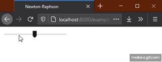
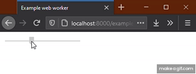

# Responsive C++ in the browser using web workers

In an [earlier blogpost](../js-webapp/README.md) we discussed how to run C++ code on the web using JavaScript. We created a web app that executed some C++ code and then showed the result in the browser. While the page was running the C++ code, the page was blocked and unresponsive. That was not a problem then, because the computation done in the code was very quick. Blocked User Interface (UI) becomes a problem when we are performing tasks that take a bit longer to run.

_How to prevent blocking when running long running tasks in C++?_

In this blogpost, we will use web workers to solve this problem by offloading tasks to another thread.

## Long-running tasks with web worker

Let's have a look at the code we ended up with in the last blog. When loading the page, the WebAssembly code is executed, after which the page can finish rendering. Because the WebAssembly code was very quick, this was fine. For this blog, we assume we have a longer running task. We create such a task artificially, by adding a few seconds of `sleep` in the [C++ code](newtonraphson_slow.cpp). Like in the previous post, we compile the C++ code to create WebAssembly code. The example page with our slow task can be found [here](https://nlesc-jcer.github.io/run-cpp-on-web/js-webapp-async/example-blocking.html).

Notice that we also added a slider to the page. This slider simply serves to illustrate UI blockage--it has no attached function. Notice that while the WebAssembly code is still running, the slider is completely unresponsive. If this was an actual web app and not just a demo, the UI blocking would surely annoy users and possibly make working with the app cumbersome and impractical. We can easily solve this, and keep the UI responsive at all times, using web workers.



_Blocked UI while code is running._

## Web workers

A [web worker](https://developer.mozilla.org/en-US/docs/Web/API/Web_Workers_API) is an object that handles execution of a piece of code in another thread.

The way the page communicates with the worker object is through sending messages. The page will send a message to the worker to start doing work, and the message will include all data that the worker needs. The worker then starts executing the task, using only the data that was in the message. The worker will not be able to access any data in the web app directly. When finished the worker needs to communicate the results back to the web app. It will do this by sending a message, so the web app knows when to update.

## The resulting page

Below is the code for the web app. Notice the creation of the `Worker` object, posting of the message, as well as the instructions for handling of any returned messages containing results.

The web page that uses the worker will look like:

```html
<!doctype html>
<html lang="en">
  <head>
    <title>Web worker example</title>

    <script>
      const worker = new Worker('worker.js');
      worker.postMessage({
        type: 'CALCULATE',
        payload: { tolerance: 0.001, initial_guess: -4.0 }
      });
      worker.onmessage = function(message) {
        if (message.data.type === 'RESULT') {
          const root = message.data.payload.root;
          document.getElementById('answer')
		     .innerHTML = "Function root is approximately at x = " +
                          root.toFixed(2);
        }
      }
    </script>
  </head>
  <body>
    <div class="slidecontainer">
      <input type="range" min="1" max="100" value="50" class="slider" id="myRange">
    </div>
    <span id="answer"> </span>
  </body>
</html>
```

The web worker code will only contain handling of the incoming message. In this case, the web worker will unpack the message, do the calculation, and pack the results in a new message that it will send back.

The code for the worker in `worker.js` will now look like:

```js
importScripts('newtonraphson.js');

onmessage = function(message) {
  if (message.data.type === 'CALCULATE') {
    createModule().then(({rootfinding}) => {
      const tolerance = message.data.payload.tolerance;
      const finder = new NewtonRaphson(tolerance);
      const initial_guess = message.data.payload.initial_guess;
      const root = finder.solve(initial_guess);
      postMessage({
        type: 'RESULT',
        payload: {
          root: root
        }
      });
    });
  }
};
```

We can see the code in action [here](https://nlesc-jcer.github.io/run-cpp-on-web/js-webapp-async/example-web-worker.html). The calculation still takes the same time to perform, but as you will notice, the slider will be responsive all the time.



_Responsive UI thanks to the web worker._

## Outro

In this blog post we have learned how to run long running C++ code on the web using web workers.

In the [next blogpost](../js-react/README.md) we will show how to expand the code to an interactive React webapp.
