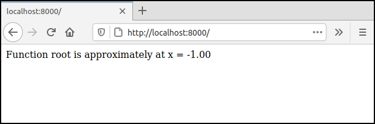

# Run your C++ code on the web

Let's say you have some C or C++ code laying around that you would like to make available to a wider audience, by putting
it on the web. Until recently, this used to be pretty difficult, and may even have required reimplementation of the
software in JavaScript, the programming language that browsers use.

_Wouldn't it be great if you could run your existing C/C++ code on the web with only minor effort?_

That way, loads more people would be able to see your results, interact with your algorithm, and apply it for their own
purposes.

In this blog, we'll show you how to take a simple algorithm written in C++ and make it available as a web
application. Subsequent blogs in this series will expand on the current one by laying out more advanced topics,
specifically how to [make the app interactive](anotherblog), how to [visualize the results](someotherblog), and
how to [deal with long running tasks](yetanotherblog).

## Root finding

So today's aim is to have a simple web app that determines the root of a mathematical function _x^3 - x^2 + 2_, i.e. the
value of _x_ where _y = 0_.


Function _x^3 - x^2 + 2_.

For this, we'll use an iterative method known as the [_Newton-Raphson_ root finding
method](https://www.youtube.com/watch?v=cOmAk82cr9M). Remember Newton? Quiet fellow, fabulous hair? Yes, _that_ Newton.
The way Newton-Raphson works is, you give it the equation whose root you want to find, along with the derivative of
that equation. Then you take an ``initial_guess`` of what you think the value of the root could be, then let the method
iterate towards the solution. The solution is approximate within a ``tolerance``, which you can also set. Anyway, the
algorithm is written C++, but **with some trickery, we'll be able to use that C++ code from the browser, without the
need to port it first**!


_Newton (and his hair)._

Now before you say _"That'll be so much slower than running it native!"_ or _"C/C++ from the browser? Impossible!"_,
just hold your horses for a sec. With the right tools, it is possible to run C/C++ code in the browser, with an acceptable performance penalty. For example, Gabriel Cuvillier was able to run the video game _Doom 3_ [in the
browser](http://wasm.continuation-labs.com/d3demo/). He was able to do this by compiling the game's source code into
WebAssembly, a low-level language that browsers can run. And if it works for video games, it will likely work for your
research software, too.


_Hold your horses._

## What we'll need

OK, now that you're fully on board with this, let's get to it. Here's a list of what we need:

1. We are going to write a small HTML page, so you will need basic knowledge of [HTML](https://developer.mozilla.org/en-US/docs/Learn/Getting_started_with_the_web/HTML_basics) and [JavaScript](https://developer.mozilla.org/en-US/docs/Web/JavaScript).
1. Some C/C++ code to illustrate the process. We'll use our Newton-Raphson C++ code.
1. A program that can take our existing C/C++ code and compile it into a WebAssembly module. For this, we'll use
[Emscripten](https://emscripten.org/)'s ``emcc`` compiler, the most popular C++ to WebAssembly compiler of the bunch.
1. To use the WebAssembly functionality from JavaScript, a binding is required. The binding will map C++ constructs to
their JavaScript equivalent and back. For this, we'll use
[embind](https://emscripten.org/docs/porting/connecting_cpp_and_javascript/embind.html#embind).
1. A web server to serve our files. We'll use Python 3's ``http.server``, but other web servers work equally well.

## Tying it all together

### The C++ code

Here is the equation whose root we want to find, along with its derivative, since that's what Newton-Raphson requires:

```cpp
// An example equation
double equation(double x) {
  return x * x * x - x * x + 2;
}

// Derivative of the above equation
double derivative(double x) {
  return 3 * x * x - 2 * x;
}
```
File: _algebra.cpp_

The snippet below shows the contents of the file ``newtonraphson.hpp``. It is the header file for the Newton-Raphson
iterative root finding algorithm. It defines a class named ``NewtonRaphson``. Besides the
constructor method ``NewtonRaphson(double tolerance_in)``, ``NewtonRaphson`` has one other public method, ``solve``,
which takes a ``double``, and returns another ``double``. Furthermore, ``NewtonRaphson`` also has a private member,
``tolerance`` of type ``double``, which is used to store the class instance's private data.

```cpp
#ifndef H_NEWTONRAPHSON_H
#define H_NEWTONRAPHSON_H

class NewtonRaphson {
  public:
    NewtonRaphson(double tolerance_in);
    double solve(double initial_guess);
  private:
    double tolerance;
};
#endif
```
File: _newtonraphson.hpp_.

File ``newtonraphson.cpp`` contains the corresponding implementation:

```cpp
#include "newtonraphson.hpp"
#include "algebra.cpp"
#include <math.h>

// Define the constructor method of NewtonRaphson instances
NewtonRaphson::NewtonRaphson(double tolerance_in) : tolerance(tolerance_in) {}

// Define the 'solve' method of NewtonRaphson instances
double NewtonRaphson::solve(double initial_guess) {
  double x = initial_guess;
  double delta_x = 0;
  do {
    delta_x = equation(x) / derivative(x);
    x = x - delta_x;
  } while (fabs(delta_x) >= tolerance);
  return x;
};
```
File: _newtonraphson.cpp_.

From this definition, ``NewtonRaphson`` instances need to be initialized with a value for ``tolerance_in``, which is then
stored as the private member ``tolerance``. Once the object instance has been constructed, users can call its ``solve``
method to iteratively find ``equation``'s root, with ``equation`` and its ``derivative`` being imported from
``algebra.cpp`` via the ``include`` line near the top.

### Check on command line

The following code is a minimal command line program that we can use to check if everything is working correctly:

```cpp
#include <iostream>
#include <iomanip>

#include "newtonraphson.hpp"

int main() {
  double initial_guess = -4;
  double tolerance = 0.001;
  NewtonRaphson newtonraphson(tolerance);
  double root = newtonraphson.solve(initial_guess);

  std::cout << "Function root is approximately at x = ";
  std::cout << std::fixed << std::setprecision(2) << root << std::endl;

  return 0;
}
```
File: _cli.cpp_.

Our command line program can be compiled with:

```shell
g++ -o cli.exe cli.cpp newtonraphson.cpp
```

Subsequently running it should give the following output:

```shell
./cli.exe
The value of the root is : -1.00
```

Now we're ready to move on to the WebAssembly part.

### Binding

To use the Newton-Raphson code from JavaScript, we'll need to define the _bindings_ file. The binding allows compiled code
to be called from JavaScript. For our Newton-Raphson code, the binding file looks like this:

```cpp
#include <emscripten/bind.h>
#include "newtonraphson.hpp"

using namespace emscripten;

EMSCRIPTEN_BINDINGS(newtonraphson) {
   class_<NewtonRaphson>("NewtonRaphson")
      .constructor<double>()
      .function("solve", &NewtonRaphson::solve)
      ;
}
```
File: _bindings.cpp_.

The binding file uses [``embind`` binding
statements](https://emscripten.org/docs/porting/connecting_cpp_and_javascript/embind.html#classes) to expose the
``NewtonRaphson`` class, its constructor method, as well as its public method ``solve``.

### Compiling to WebAssembly

First we need to [download and install](https://emscripten.org/docs/getting_started/downloads.html) Emscripten to get the compiler.
The Newton-Raphson source and its binding can be compiled into a WebAssembly module with Emscripten's ``emcc`` compiler, as follows:

```shell
emcc -I. -o newtonraphson.js -Oz -s MODULARIZE=1 \
   -s EXPORT_NAME=createModule --bind newtonraphson.cpp bindings.cpp
```

This will generate a WebAssembly module ``newtonraphson.wasm``, along with a JavaScript file ``newtonraphson.js``. Using
this JavaScript library, we can find the root of the mathematical function, and subsequently display its value with the
following HTML:

```html
<html>
   <head>
      <!-- Load WebAssembly module -->
      <script type="text/javascript" src="newtonraphson.js"></script>
   </head>
   <body>
      <div>
         Function root is approximately at x =
         <span id="answer"/>
      </div>
      <script>
         // Wait for module to initialize,
         createModule().then(({NewtonRaphson}) => {
            // Hardcoded input values
            const initial_guess = -4;
            const tolerance = 0.001;
            // Perform computation
            const newtonraphson = new NewtonRaphson(tolerance);
            const root = newtonraphson.solve(initial_guess);
            // Write the value of 'root' to the tag whose 'id' is equal to "answer"
            document.getElementById("answer").innerHTML = root.toFixed(2);
         });
      </script>
   </body>
</html>
```
File: _index.html_.

### Hosting the app with a web server

We'll need a web server to display the HTML page in a web browser. For this, we'll use the
[http.server](https://docs.python.org/3/library/http.server.html) module from Python 3 to host all files on port 8000, like so:

```shell
python3 -m http.server 8000
```

From the figure at the top of the article, the root of the equation should be at `x = -1.00`. Visit
[http://localhost:8000/](http://localhost:8000/) to see if your browser shows the correct result.



_The resulting page if everything works._

## Recap

1. We wrote a simple algorithm in C++
2. We defined the JavaScript interface by writing Emscripten bindings
3. We compiled the algorithm and bindings to a WebAssembly module with Emscripten compiler
4. We ran the algorithm in a web browser using some JavaScript to talk to the WebAssembly module.

The nice thing about this solution is that we don't need expensive infrastructure to perform computation as the
computation is done in the user's web browser--we just need somewhere to host the files.

## Where to go from here?

In upcoming blogs we will see how we can perform the computation without blocking the user interface, how to make a nice
interactive form, and how to make a visualization to show data from each iteration. We'll wrap up the series in a final
blog that combines the topics of the whole series in a full-featured web application.

If you enjoyed this article, make sure to give us a clap!
