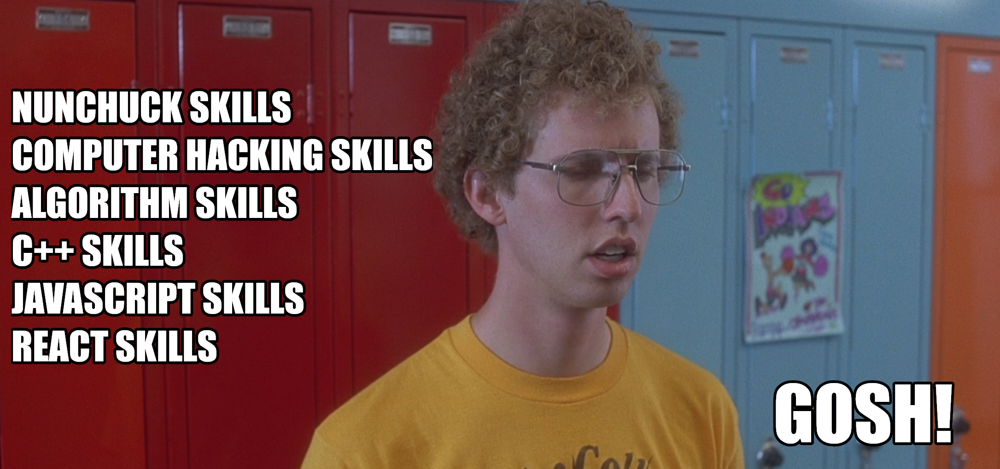
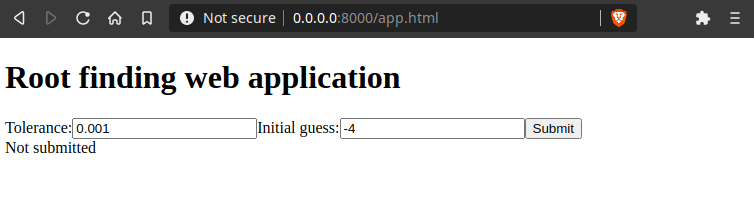

_By [Stefan Verhoeven](https://orcid.org/0000-0002-5821-2060), [Faruk Diblen](https://orcid.org/0000-0002-0989-929X),
[Jurriaan H. Spaaks](https://orcid.org/0000-0002-7064-4069), [Adam Belloum](https://orcid.org/0000-0001-6306-6937), and
[Christiaan Meijer](https://orcid.org/0000-0002-5529-5761)._

# Interact with your C++ web app using React forms

In a [previous blog post](../webassembly/README.md), we compiled the C++ algorithm into a WebAssembly code. In this blog post, we will create a web application using [React](https://reactjs.org/). The web application will have a web form that allows us to change the parameters of the algorithm.

I can feel your pain: there are too many things to learn, too many skills to get but too little time available which reminds me of our extra-ordinary friend [Napoleon Dynamite](https://www.imdb.com/title/tt0374900/). This blog post will guide you through the process of making a React web application without getting lost.


_If you haven't met Napoleon yet, [click here](https://www.youtube.com/watch?v=XsiiIa6bs9I) to see how he was struggling with his skills. Screenshot from [Napoleon Dynamite](https://www.imdb.com/title/tt0374900/) movie._

## React web application

The web application we developed so far needs to update the entire page to display the results. Even for small changes in the web page this has to happen. Thanks to modern web browsers and JavaScript, Single Page Applications (SPA) can update only required elements in the web page. We will use one of the most popular web-frameworks, React, to develop the SPA. We preferred React over vanilla JavaScript because it is faster and easier to build a web application. Just let React deal with all the magic behind the scenes. [This blog post](https://www.freecodecamp.org/news/do-we-still-need-javascript-frameworks-42576735949b/) may help you to understand why we made this choice.

The form in the web application will collect the user inputs and use them to initialize the algorithm. When the form is submitted, a WebAssembly code starts the calculation and the result is rendered. With this architecture, the application only needs cheap static file hosting to host the HTML, JavaScript, and WebAssembly files. The algorithm will be running in the web browser on the end-users machine instead of a server.

### The HTML code

To render the React application we need an HTML element as a container. We will give it the identifier **container** which will use later when we implement the **React** application.

We will keep the html code very minimal. The code will contain three essential elements:

- **\<head\>** element to set the title and to load the required external dependencies (javascript libraries).

  ```html
  <head>
    <title>Example React application</title>
    <script src="https://unpkg.com/react@16/umd/react.development.js" crossorigin></script>
    <script src="https://unpkg.com/react-dom@16/umd/react-dom.development.js" crossorigin></script>
    <script src="https://unpkg.com/babel-standalone@6/babel.min.js"></script>
  </head>
  ```

- **\<div\>** element to display the result

  ```html
  <div id="container"></div>
  ```

- **\<script\>** elements to load the Javascript application and the ``NewtonRaphson`` class.

  ```html
    <script type="text/javascript" src="newtonraphson.js"></script>
    <script type="text/babel" src="app.js"></script>
  ```

**Note:** We use the same `newtonraphson.js` and `newtonraphson.wasm` files as in the [first post](../webassembly/README.md) of this series. Make sure you download [newtonraphson.js](https://github.com/NLESC-JCER/run-cpp-on-web/blob/master/react/newtonraphson.js) and [newtonraphson.wasm](https://github.com/NLESC-JCER/run-cpp-on-web/blob/master/react/newtonraphson.wasm) files from GitHub.

The complete HTML code will look like this:

```html
<!doctype html>
<html lang="en">
  <head>
    <title>Example React application</title>
    <script src="https://unpkg.com/react@16/umd/react.development.js" crossorigin></script>
    <script src="https://unpkg.com/react-dom@16/umd/react-dom.development.js" crossorigin></script>
    <script src="https://unpkg.com/babel-standalone@6/babel.min.js"></script>
  </head>
  <script type="text/javascript" src="newtonraphson.js"></script>
  <script type="text/babel" src="app.js"></script>
  <div id="answer"></div>
</html>
```

## Javascript code (React)

Similarly, we will split the JavaScript code into sections and build up the React application from React components.

Let's start with the header part. We will define a JavaScript function that returns the header element which will be rendered by the web browser when the user visits the page.

```js
function Heading() {
  const title = 'Root finding web application';
  return <h1>{title}</h1>
}
```

The return statement of this function looks weird, right? It is indeed not HTML. React uses a syntax extension called [JSX](https://reactjs.org/docs/introducing-jsx.html) to describe the UI. With the magical conversion of [Babel](https://babeljs.io/docs/en/next/babel-standalone.html) we can convert JSX into JavaScript code. After this conversion the generated JavaScript code will look like:

```js
function Heading() {
  const title = 'Root finding web application';
  return React.createElement('h1', null, `{title}`);
}
```

I now can hear what you are saying: but wait... How do I use Babel? We haven't included it anywhere. Yes, we did. Babel was already added to the HTML code.

```html
<script src="https://unpkg.com/babel-standalone@6/babel.min.js"></script>
```

In order for the header element to be rendered we need to tell **ReactDOM** which element it should render and where it should be displayed. Do you still remember the **container** div we defined in the HTML part?

```js
ReactDOM.render(
  <Heading/>,
  document.getElementById('answer')
);
```

The complete code should like this.

```js
function Heading() {
  const title = 'Root finding web application';
  return <h1>{title}</h1>
}

ReactDOM.render(
  <Heading/>,
  document.getElementById('container')
);
```

When the page is rendered, the generated HTML code will be like:

```html
<h1>Root finding web application</h1>
```

## Adding the  web form

The web application in our example should have a form with ``tolerance`` and ``initial_guess`` input fields, as well as, a submit button. The form in JSX can be written in the following way:

```js
<form onSubmit={handleSubmit}>
  <label>
    Tolerance:
    <input name="tolerance" type="number" value={tolerance} onChange={onToleranceChange}/>
  </label>
  <label>
    Initial guess:
    <input name="initial_guess" type="number" value={initial_guess} onChange={onGuessChange}/>
  </label>
  <input type="submit" value="Submit" />
</form>
```

The form tag has a `onSubmit` property, which is set to a function (`handleSubmit`) that will handle the form
submission. The input tag has a `value` property to set the variable (`tolerance` and `initial_guess`) and it also has `onChange`
property to set the function (`onToleranceChange` and `onGuessChange`) which will be triggered when the user changes the
value.

Let's implement the `value` and `onChange` for the `tolerance` input.
To store the value we will use the [React useState hook](https://reactjs.org/docs/hooks-state.html).

```js
const [tolerance, setTolerance] = React.useState(0.001);
const [initial_guess, setGuess] = React.useState(-4);
```

The argument of the `useState` function is the initial value. The `tolerance` variable contains the current value for tolerance and `setTolerance` is a function to set the `tolerance` to a new value. The same logic is also used for the `initial_guess` variable.

The input tag in the form will call the `onChange` function with a event object. We need to extract the user input from the event and pass it to `setTolerance` or `setGuess`. The value should be a number, so we use `Number()` to cast the string from the
event to a number.

```js
function onToleranceChange(event) {
  setTolerance(Number(event.target.value));
}

function onGuessChange(event) {
  setGuess(Number(event.target.value));
}
```

We are now ready to implement the `handleSubmit` function which will process the submitted form data. The function will get, similar to the `onChange` of the input tag, an event object. Normally when you submit a form the form fields will be sent to the server, but we want to perform the calculation in the browser so we have to disable the default action with `preventDefault()` function. We will then construct a module as we did in the previous post.

```jsx
function handleSubmit(event) {
  event.preventDefault();
  // Wait for module to initialize,
  createModule().then(({NewtonRaphson}) => {
    // Perform computation
    const newtonraphson = new NewtonRaphson(tolerance);
    const root = newtonraphson.solve(initial_guess);
    setRoot(root);
  });
}
```

We need a place to store the result of the calculation (`root` value), we will use `useState` function again. The
initial value of the result is set to `undefined` as the result is only known after the calculation has been completed.

```jsx
const [root, setRoot] = React.useState(undefined);
```

When the calculation is done it will store the result value (`root`) using `setRoot`.


To render the result we can use a React Component which has `root` as a property. When the calculation has not been done
yet, it will render `Not submitted`. When the `root` property value is set then we will show it.

```jsx
function Result(props) {
  const root = props.root;
  let message = 'Not submitted';
  if (root !== undefined) {
    message = 'Function root is approximately at x = ' + root.toFixed(2);
  }
  return <div id="answer">{message}</div>;
}
```

Finally we can render the `App` component to the HTML container with `container` as identifier.

```js
ReactDOM.render(
  <App/>,
  document.getElementById('container')
);
```

We can combine the heading, form and result components and all the states and `handleSubmit` function into the `App` React component and its rendering and save it as `app.js`. If you are lazy, you can find the code from [here](https://github.com/NLESC-JCER/run-cpp-on-web/blob/master/react/app.js).

Like before, we also need to host the files in a web server with

```shell
python3 -m http.server 8000
```



_The final page if everything works._

Visit [http://localhost:8000/app.html](http://localhost:8000/app.html) to see the root answer or see the example app hosted on [GitHub pages](https://nlesc-jcer.github.io/run-cpp-on-web/react/app.html).

## Extra notes

The code supplied here should not be used in production as converting JSX in the web browser is slow. It's better to use [Create React App](http://create-react-app.dev/) which gives you an infrastructure to perform the transformation offline.

## Conclusion

By writing React components we were able to create an interactive page with a form that executes the WebAssembly module compiled from the C++ code we introduced in the [first blog](../webassembly/README.md) of the series.

We went through the components, JSX, props, and state which are the core building blocks of React web application.

In other blogs of the series that might be of interest we cover

- [Using C++ in a web app with WebAssembly](../webassembly/README.md): How to turn C++ code into a web app.
- [Help! My C++ web app is not responding](../web-worker/README.md): How to use web workers to perform computations without blocking the user interface.
- [Spice up your C++ web app with visualizations](../vega/README.md): Plotting data from the C++ web app using web visualization.

We'll wrap up the series in a [final blog](../kitchen-sink/README.md) that combines the topics of the whole series in a full-featured web application.

## Get in touch with us

This blog was written by Generalization Team of Netherlands eScience Center. The team consists of Stefan Verhoeven, Faruk Diblen, Jurriaan H. Spaaks, Adam Belloum and Christiaan Meijer. Feel free to get in touch with the generalization team at generalization@esciencecenter.nl.

If you enjoyed this article, leave a comment and give us a clap!

_These blogs were written as part of the "Passing XSAMS" project. To learn more about the project, check out its
[project page](https://www.esciencecenter.nl/projects/passing-xsams/)._
