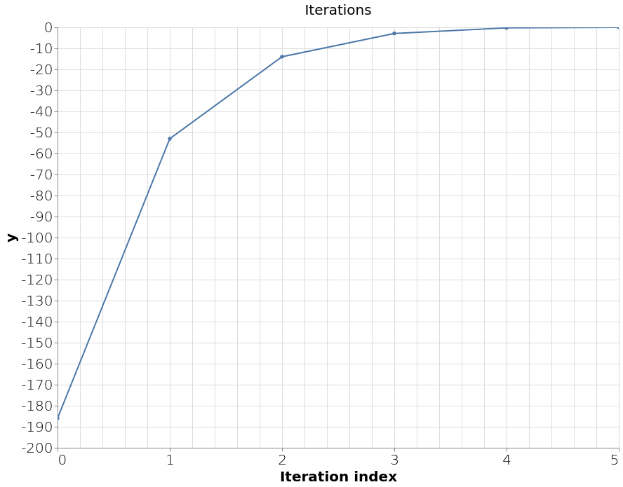

# Show me the visualization

In a [previous blog](../run-your-c%2B%2B-code-on-the-web) we found the root of an equation using the Newton-Raphson
algorithm implemented in C++ and compiled to a WebAsssembly module. In this blog, we're going to expand on that by
visualizing the iterations that Newton-Raphson used to get from the initial guess to the estimate of the root. 


_Visualization allows us to track what's going on under the hood of our program. Image courtesy of [Nenad Stojkovic](https://www.flickr.com/photos/nenadstojkovic/49044775348)._

## Iterations

The Newton-Raphson algorithm approximates the value of the target equation's root in a series of iterations. We capture
the data of each iteration using the following `struct`:

* `x`: x value, starting with the value of  `initial_guess` and ending with the estimate of the `equation`'s root
* `y`: result of passing `x` through `equation`
* `slope`: result of passing `x` through `derivative`
* `delta_x`: `y` divided by `slope`

Extending the `NewtonRaphson` class accordingly yields the following header file:

```cpp
#ifndef H_NEWTONRAPHSON_HPP
#define H_NEWTONRAPHSON_HPP

#include <vector>

struct Iteration {
  int index;
  float x;
  float y;
  float slope;
  float delta_x;
};

class NewtonRaphson {
  public:
    NewtonRaphson(float tolerance_in);
    float solve(float initial_guess);
    std::vector<Iteration> iterations;
  private:
    float tolerance;
};
#endif
```
File: _newtonraphson.hpp_

The `do` loop in `newtonraphson.cpp` is updated to include a `push_back` to the `iterations` vector. This way, we can
record the value of relevant variables in each cycle, as follows:

```cpp
#include "newtonraphson.hpp"
#include "algebra.cpp"
#include <math.h>

// Define the constructor method of NewtonRaphson instances
NewtonRaphson::NewtonRaphson(float tolerance_in) : tolerance(tolerance_in) {}

// Define the 'solve' method of NewtonRaphson instances
float NewtonRaphson::solve(float initial_guess) {
  float x = initial_guess;
  float delta_x = 0.0;
  int i = 0;
  do {
    delta_x = equation(x) / derivative(x);
    iterations.push_back({i++, x, equation(x), derivative(x), delta_x});
    x = x - delta_x;
  } while (fabs(delta_x) >= tolerance);
  return x;
};
```
File: _newtonraphson.cpp_.

Before we go into the Emscripten world, let's first test our C++ code. We can check if the iteration property is populated correctly, by extending the command line interface we made in the [previous blog](../run-your-c%2B%2B-code-on-the-web) as follows:

```cpp
#include <iostream>
#include <iomanip>

#include "newtonraphson.hpp"

int main() {
  float initial_guess = -4;
  float tolerance = 0.001;
  NewtonRaphson newtonraphson(tolerance);
  newtonraphson.solve(initial_guess);

  std::cout << std::fixed;
  std::cout << std::setprecision(2);

  for (Iteration iteration : newtonraphson.iterations) {
    std::cout << "index = " << iteration.index;
    std::cout << " x = " << iteration.x;
    std::cout << " y = " << iteration.y;
    std::cout << " slope = " << iteration.slope;
    std::cout << " delta_x = " << iteration.delta_x << std::endl;
  }
  return 0;
}
```
File: _cli.cpp_.

Compile it with:

```shell
g++ -o cli.exe newtonraphson.cpp cli.cpp
```

Run with:

```shell
./cli.exe
index = 0 x = -4.00 y = -186.00 slope = 128.00 delta_x = -1.45
index = 1 x = -2.55 y = -52.99 slope = 59.29 delta_x = -0.89
index = 2 x = -1.65 y = -13.97 slope = 29.63 delta_x = -0.47
index = 3 x = -1.18 y = -2.89 slope = 17.83 delta_x = -0.16
index = 4 x = -1.02 y = -0.28 slope = 14.40 delta_x = -0.02
index = 5 x = -1.00 y = -0.00 slope = 14.01 delta_x = -0.00
```

The last iteration has `x = -1.00`, which is what we expected.

## Bindings

Emscripten can handle simple types like `float` and `int`, but needs help exposing more complex types to JavaScript like the `iterations` property.
We need to use [`value_object`](https://emscripten.org/docs/porting/connecting_cpp_and_javascript/embind.html#value-types) to expose the `Iteration` `struct` and [`register_vector`](https://emscripten.org/docs/porting/connecting_cpp_and_javascript/embind.html#built-in-type-conversions) as the `iterations` property type.

So the bindings look like this:

```cpp
#include <emscripten/bind.h>
#include "newtonraphson.hpp"

using namespace emscripten;

EMSCRIPTEN_BINDINGS(newtonraphson) {
  class_<NewtonRaphson>("NewtonRaphson")
    .constructor<float>()
    .function("solve", &NewtonRaphson::solve)
    .property("iterations", &NewtonRaphson::iterations)
    ;

  value_object<Iteration>("Iteration")
    .field("index", &Iteration::index)
    .field("x", &Iteration::x)
    .field("y", &Iteration::y)
    .field("slope", &Iteration::slope)
    .field("delta_x", &Iteration::delta_x)
    ;

  register_vector<Iteration>("vector<Iteration>");
}
```
File: _bindings.cpp_.

We can now compile our C++ code to a WebAssembly module with Emscripten using `emcc` command, exactly [like we did before](../run-your-c%2B%2B-code-on-the-web):

```shell
emcc -I. -o newtonraphson.js -Oz -s MODULARIZE=1 \
  -s EXPORT_NAME=createModule --bind newtonraphson.cpp bindings.cpp
```

To get the iteration data in JavaScript we use the following code

```javascript
const initial_guess = -4;
const tolerance = 0.001;
const newtonraphson = new NewtonRaphson(tolerance);
newtonraphson.solve(initial_guess);
// newtonraphson.iterations is a vector object, which is not
// consumeable by Vega, so we need to convert Emscripten's
// vector of objects to a JavaScript array of objects first
const iterations = new Array(
    newtonraphson.iterations.size()
).fill().map(
  (_, iteration) => {
    return newtonraphson.iterations.get(iteration)
  }
);
```

Let's have a look at the data we want to plot, by logging it to the console with `console.log(JSON.stringify(iterations, null, 2))`, which should return the following data:

```json
[
  {
    "index": 0,
    "x": -4,
    "y": -186,
    "slope": 128,
    "delta_x": -1.453125
  },
  {
    "index": 1,
    "x": -2.546875,
    "y": -52.987266540527344,
    "slope": 59.29443359375,
    "delta_x": -0.8936296938691481
  },
  {
    "index": 2,
    "x": -1.6532453061308519,
    "y": -13.97024657989909,
    "slope": 29.62528270250898,
    "delta_x": -0.4715650048030071
  },
  {
    "index": 3,
    "x": -1.1816803013278447,
    "y": -2.8855952468476467,
    "slope": 17.831652417900354,
    "delta_x": -0.16182433232889476
  },
  {
    "index": 4,
    "x": -1.01985596899895,
    "y": -0.28194181784318495,
    "slope": 14.39948493700832,
    "delta_x": -0.01957999324813086
  },
  {
    "index": 5,
    "x": -1.000275975750819,
    "y": -0.0038644221796557687,
    "slope": 14.005519971992072,
    "delta_x": -0.00027592136438945176
  }
]
```

Great, that looks very similar to the output we got from the command line.

## Vega-Lite specification

There [many ways to do visualizations](https://github.com/sorrycc/awesome-javascript#data-visualization) on the web. My personal favorite at the moment is [Vega-Lite](https://vega.github.io/vega-lite/), so we will use it here.
Vega-Lite is a JavaScript library which describes a plot using a JSON document. In Vega-Lite the JSON Document is called a specification and can be rendered to an interactive visualization.

The root finding algorithm tries to find the x where y is zero.
So let's plot the iteration index against the y found in each iteration to see how quickly it converged to an answer.

Besides `width`, `height` and `title`, the Vega-Lite specification has the following blocks

* `"data"`, the iterations we want to plot as an array of iteration objects
* `"encoding"`, which field should go on which axis
* `"mark"`, for line plot use [line](https://vega.github.io/vega-lite/docs/line.html) marker
* `"selection"`, for defining how users can interact with the plot

```js
const spec = {
  "$schema": "https://vega.github.io/schema/vega-lite/v4.json",
  "width": 800,
  "height": 600,
  "title": {
    "text": "Iterations",
    "fontSize": 20,
    "fontWeight": "normal"
  },
  "data": {
    "values": iterations
  },
  "encoding": {
    "x": {
      "field": "index",
      "type": "quantitative",
      "title": "Iteration index",
      "axis": {
        "labelFontSize": 20,
        "titleFontSize": 20,
        "labelFontWeight": "lighter",
        "tickMinStep": 1.0
      }
    },
    "y": {
      "field": "y",
      "type": "quantitative",
      "axis": {
        "labelFontSize": 20,
        "titleFontSize": 20,
        "labelFontWeight": "lighter"
      }
    }
  },
  "mark": {
    "type": "line",
    "point": true,
    // Enable tooltip so on mouseover it shows all data of that iteration
    "tooltip": {"content": "data"}
  },
  // Enable zooming and panning
  "selection": {"grid": {"type": "interval", "bind": "scales"}}
};
```

To render a specification we need to use the `vegaEmbed(element, spec)` method which accepts an HTML element and a Vega-Lite specification.

```html
<html>
  <head>
    <script type="text/javascript" src="newtonraphson.js"></script>
    <script src="https://cdn.jsdelivr.net/npm/vega@5.13.0"></script>
    <script src="https://cdn.jsdelivr.net/npm/vega-lite@4.13.0"></script>
    <script src="https://cdn.jsdelivr.net/npm/vega-embed@6.8.0"></script>
  </head>
  <body>
    <div id="plot"></div>
    <script>
      ...
      vegaEmbed(document.getElementById("plot"), spec);
    </script>
  </body>
</html>
```

The complete HTML page looks like this:

```html
<html>
  <head>
    <script type="text/javascript" src="newtonraphson.js"></script>
    <script src="https://cdn.jsdelivr.net/npm/vega@5.13.0"></script>
    <script src="https://cdn.jsdelivr.net/npm/vega-lite@4.13.0"></script>
    <script src="https://cdn.jsdelivr.net/npm/vega-embed@6.8.0"></script>
  </head>
  <body>
    <div id="plot"></div>
    <script>
      createModule().then(({NewtonRaphson}) => {
        const initial_guess = -4;
        const tolerance = 0.001;
        const newtonraphson = new NewtonRaphson(tolerance);
        newtonraphson.solve(initial_guess);
        // newtonraphson.iterations is a vector object which not consumeable by Vega
        // So convert Emscripten vector of objects to JavaScript array of objects
        const iterations = new Array(
            newtonraphson.iterations.size()
        ).fill().map(
          (_, iteration) => {
            return newtonraphson.iterations.get(iteration)
          }
        );
        // Open console in DevTools (F12) to see iterations data as a JSON string
        console.log(JSON.stringify(iterations, null, 2));
        const spec = {
          "$schema": "https://vega.github.io/schema/vega-lite/v4.json",
          "width": 800,
          "height": 600,
          "title": {
            "text": "Iterations",
            "fontSize": 20,
            "fontWeight": "normal"
          },
          "data": {
            "values": iterations
          },
          "encoding": {
            "x": {
              "field": "index",
              "type": "quantitative",
              "title": "Iteration index",
              "axis": {
                "labelFontSize": 20,
                "titleFontSize": 20,
                "labelFontWeight": "lighter",
                "tickMinStep": 1.0
              }
            },
            "y": {
              "field": "y",
              "type": "quantitative",
              "axis": {
                "labelFontSize": 20,
                "titleFontSize": 20,
                "labelFontWeight": "lighter"
              }
            }
          },
          "mark": {
            "type": "line",
            "point": true,
            // Enable tooltip so on mouseover it shows all data of that iteration
            "tooltip": {"content": "data"}
          },
          // Enable zooming and panning
          "selection": {"grid": {"type": "interval", "bind": "scales"}}
        };
        vegaEmbed(document.getElementById("plot"), spec);
      });
    </script>
  </body>
</html>
```
File: _scatter.html_.

We'll need a web server to display the HTML page in a web browser. For this, we'll use the `http.server` module from Python 3 to host all files on port 8000, like so:

```shell
python3 -m http.server 8000
```

When we visit the web page at [http://localhost:8000/scatter.html](http://localhost:8000/scatter.html), we will be greeted by the following plot. We can zoom with the mouse wheel and pan by dragging. Hovering over a point shows a tooltip with relevant data at that point.

[](https://nlesc-jcer.github.io/run-cpp-on-web/show-me-the-visualization/scatter.html)
(Click on image to get interactive version)

## Advanced plot

In the first blog of this series we plotted the equation and root as


It would be nice to write a specification of this plot together with the iterations the root finding algorithm went through.
Vega-Lite can superimpose one chart on top of another with [layers](https://vega.github.io/vega-lite/docs/layer.html) keyword.
Let's construct each layer separately and then super impose them at the end.

The 2x^3 - 4x^2 + 6 equation is plotted by using a [sequence generator](https://vega.github.io/vega-lite/docs/data.html#sequence) to generate a range of x values and a [formula transform](https://vega.github.io/vega-lite/docs/calculate.html) is used to calculate the y values.

```js
const equation_line = {
  "data": {"sequence": {"start": -4, "stop": 4, "step": 0.1, "as": "x"}},
  "transform": [
    {
      "calculate": "2 * datum.x * datum.x * datum.x - 4 * datum.x * datum.x + 6",
      "as": "y"
    }
  ],
  "mark": "line",
  "encoding": {
    "x": {"type": "quantitative", "field": "x"},
    "y": {"field": "y", "type": "quantitative"},
    "color": {"value": "#f00"}
  }
};
```

To show where the root is we draw a dotted vertical line at x is -1 with an title. For the ruler and title we reuse the data via layers and use a [rule marker](https://vega.github.io/vega-lite/docs/rule.html) and [text marker](https://vega.github.io/vega-lite/docs/text.html) respectivly.

```js
const root_rule = {
  "data": {"values": [{"x": -1}]},
  "encoding": {"x": {"field": "x", "type": "quantitative"}},
  "layer": [
    {"mark": {"type": "rule", "strokeDash": [4, 8]}},
    {"mark": {"type": "text", "align": "left", "dx": 4, "text": "Root"}}
  ]
};
```

When we plot the x and y of each iteration we can no longer see the order of iterations.
So we will use a text marker above each circle to tell us to which iteration it belongs.

```js
const iterations_scatter = {
  "data": {
    "values": iterations
  },
  "encoding": {
    "x": {"field": "x", "type": "quantitative"},
    "y": {"field": "y", "type": "quantitative"},
    "text": {"field": "index", "type": "nominal"}
  },
  "layer": [
    {
      "mark": {"type": "circle", "tooltip": {"content": "data"}},
      "selection": {"grid": {"type": "interval", "bind": "scales"}}
    },
    {"mark": {"type": "text", "dy": -10}}
  ]
};
```

Superimpose the equation, root ruler and iteration plot into a single visualization with

```js
const spec = {
  "$schema": "https://vega.github.io/schema/vega-lite/v4.json",
  "width": 800,
  "height": 600,
  "layer": [
    equation_line,
    root_rule,
    iterations_scatter
  ]
};
```

The HTML page with all JavaScript put together to make a composite plot is available [here](https://github.com/NLESC-JCER/run-cpp-on-web/blob/master/show-me-the-visualization/app.html).

Visiting the page should give us a plot like

[](https://nlesc-jcer.github.io/run-cpp-on-web/show-me-the-visualization/app.html)
(Click on image to get interactive version)

## Wrap up

In this blog we have learned how to get complex data types from a WebAssembly module using Emscripten bindings and how to write a Vega-Lite specifications to get interactive visualizations.

In other blogs of the series that might be of interest we cover

* [use of a web-worker: how to perform computations without blocking the user interface](TODO)
* [a react application: how to make a nice interactive form](TODO)

We'll wrap up the series in a [final blog](TODO) that combines the topics of the whole series in a full-featured web application.

If you enjoyed this article, leave a comment and give us a clap!
