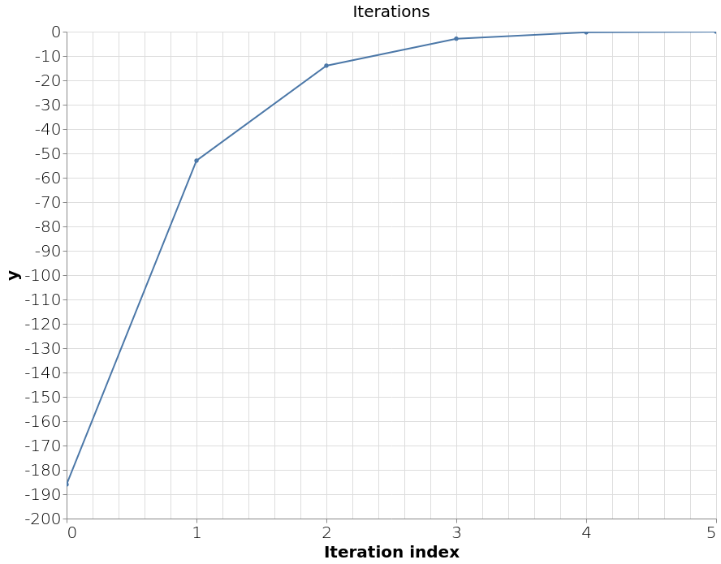
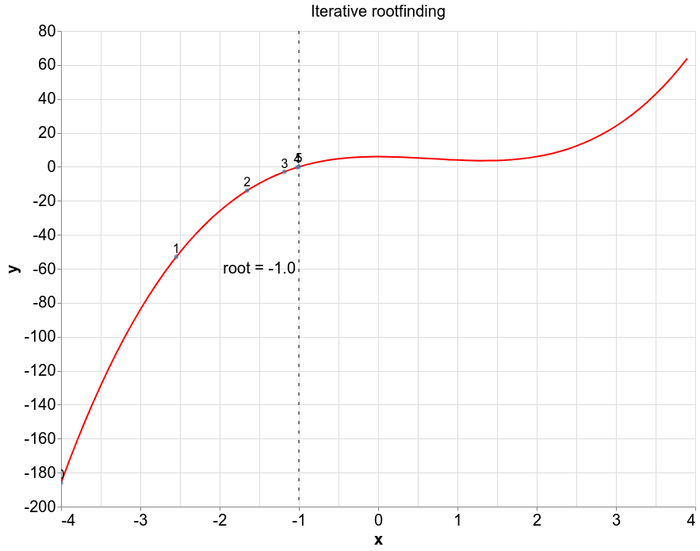

_By [Stefan Verhoeven](https://orcid.org/0000-0002-5821-2060), [Faruk Diblen](https://orcid.org/0000-0002-0989-929X),
[Jurriaan H. Spaaks](https://orcid.org/0000-0002-7064-4069), [Christiaan Meijer](https://orcid.org/0000-0002-5529-5761), and [Adam Belloum](https://orcid.org/0000-0001-6306-6937)._

# Spice up your C++ web app with visualizations

In a [previous blog](../webassembly/README.md) we found the root of an equation using the Newton-Raphson
algorithm implemented in C++ and compiled to a WebAsssembly module. In this blog, we're going to expand on that by
visualizing the iterations that Newton-Raphson used to get from the initial guess to the estimate of the root.


_Visualization allows us to track what's going on under the hood of our program. Image courtesy of [Nenad Stojkovic](https://www.flickr.com/photos/nenadstojkovic/) via [flickr](https://www.flickr.com/photos/nenadstojkovic/49044775348)._

## Iterations

The Newton-Raphson algorithm approximates the value of the target equation's root in a series of iterations. We capture
the data of each iteration using the following `struct`:

* `x`: x value, starting with the value of  `initial_guess` and ending with the estimate of the `equation`'s root
* `y`: result of passing `x` through `equation`
* `slope`: result of passing `x` through `derivative`
* `delta_x`: `y` divided by `slope`

Extending the `NewtonRaphson` class accordingly yields the following header file:

```cpp
#ifndef H_NEWTONRAPHSON_HPP
#define H_NEWTONRAPHSON_HPP

#include <vector>

struct Iteration {
  int index;
  float x;
  float y;
  float slope;
  float delta_x;
};

class NewtonRaphson {
  public:
    NewtonRaphson(float tolerance_in);
    float solve(float initial_guess);
    std::vector<Iteration> iterations;
  private:
    float tolerance;
};
#endif
```
File: _newtonraphson.hpp_

The `do` loop in `newtonraphson.cpp` is updated to include a `push_back` to the `iterations` vector. This way, we can
record the value of relevant variables in each cycle, as follows:

```cpp
#include "newtonraphson.hpp"
#include "algebra.cpp"
#include <math.h>

// Define the constructor method of NewtonRaphson instances
NewtonRaphson::NewtonRaphson(float tolerance_in) : tolerance(tolerance_in) {}

// Define the 'solve' method of NewtonRaphson instances
float NewtonRaphson::solve(float initial_guess) {
  float x = initial_guess;
  float delta_x = 0.0;
  int i = 0;
  do {
    delta_x = equation(x) / derivative(x);
    iterations.push_back({i++, x, equation(x), derivative(x), delta_x});
    x = x - delta_x;
  } while (fabs(delta_x) >= tolerance);
  return x;
};
```
File: _newtonraphson.cpp_.

Before we go into the Emscripten world, let's first test our C++ code. We can check if the iteration property is populated correctly, by extending the command line interface we made in the [previous blog](../webassembly/README.md) as follows:

```cpp
#include <iostream>
#include <iomanip>

#include "newtonraphson.hpp"

int main() {
  float initial_guess = -4;
  float tolerance = 0.001;
  NewtonRaphson newtonraphson(tolerance);
  newtonraphson.solve(initial_guess);

  std::cout << std::fixed;
  std::cout << std::setprecision(2);

  for (Iteration iteration : newtonraphson.iterations) {
    std::cout << "index = " << iteration.index;
    std::cout << " x = " << iteration.x;
    std::cout << " y = " << iteration.y;
    std::cout << " slope = " << iteration.slope;
    std::cout << " delta_x = " << iteration.delta_x << std::endl;
  }
  return 0;
}
```
File: _cli.cpp_.

Compile it with:

```shell
g++ -o cli.exe newtonraphson.cpp cli.cpp
```

Run with:

```shell
./cli.exe
index = 0 x = -4.00 y = -186.00 slope = 128.00 delta_x = -1.45
index = 1 x = -2.55 y = -52.99 slope = 59.29 delta_x = -0.89
index = 2 x = -1.65 y = -13.97 slope = 29.63 delta_x = -0.47
index = 3 x = -1.18 y = -2.89 slope = 17.83 delta_x = -0.16
index = 4 x = -1.02 y = -0.28 slope = 14.40 delta_x = -0.02
index = 5 x = -1.00 y = -0.00 slope = 14.01 delta_x = -0.00
```

The last iteration has `x = -1.00`, which is what we expected.

## Bindings

Emscripten can handle simple types like `float` and `int`, but needs help exposing more complex types to JavaScript like the `iterations` property.
We need to use [`value_object`](https://emscripten.org/docs/porting/connecting_cpp_and_javascript/embind.html#value-types) to expose the `Iteration` `struct` and [`register_vector`](https://emscripten.org/docs/porting/connecting_cpp_and_javascript/embind.html#built-in-type-conversions) as the `iterations` property type.

So the bindings look like this:

```cpp
#include <emscripten/bind.h>
#include "newtonraphson.hpp"

using namespace emscripten;

EMSCRIPTEN_BINDINGS(newtonraphson) {
  class_<NewtonRaphson>("NewtonRaphson")
    .constructor<float>()
    .function("solve", &NewtonRaphson::solve)
    .property("iterations", &NewtonRaphson::iterations)
    ;

  value_object<Iteration>("Iteration")
    .field("index", &Iteration::index)
    .field("x", &Iteration::x)
    .field("y", &Iteration::y)
    .field("slope", &Iteration::slope)
    .field("delta_x", &Iteration::delta_x)
    ;

  register_vector<Iteration>("vector<Iteration>");
}
```
File: _bindings.cpp_.

We can now compile our C++ code to a WebAssembly module with Emscripten using `emcc` command, exactly [like we did before](../webassembly/README.md):

```shell
emcc -I. -o newtonraphson.js -Oz -s MODULARIZE=1 \
  -s EXPORT_NAME=createModule --bind newtonraphson.cpp bindings.cpp
```

To get the iteration data in JavaScript we use the following code

```javascript
const initial_guess = -4;
const tolerance = 0.001;
const newtonraphson = new NewtonRaphson(tolerance);
newtonraphson.solve(initial_guess);
// newtonraphson.iterations is a vector object, which is not
// consumeable by Vega, so we need to convert Emscripten's
// vector of objects to a JavaScript array of objects first
const iterations = new Array(
    newtonraphson.iterations.size()
).fill().map(
  (_, iteration) => {
    return newtonraphson.iterations.get(iteration)
  }
);
```

Let's have a look at the data we want to plot, by logging it to the console with `console.log(JSON.stringify(iterations, null, 2))`, which should return the following data:

```json
[
  {
    "index": 0,
    "x": -4,
    "y": -186,
    "slope": 128,
    "delta_x": -1.453125
  },
  {
    "index": 1,
    "x": -2.546875,
    "y": -52.987266540527344,
    "slope": 59.29443359375,
    "delta_x": -0.8936296938691481
  },
  {
    "index": 2,
    "x": -1.6532453061308519,
    "y": -13.97024657989909,
    "slope": 29.62528270250898,
    "delta_x": -0.4715650048030071
  },
  {
    "index": 3,
    "x": -1.1816803013278447,
    "y": -2.8855952468476467,
    "slope": 17.831652417900354,
    "delta_x": -0.16182433232889476
  },
  {
    "index": 4,
    "x": -1.01985596899895,
    "y": -0.28194181784318495,
    "slope": 14.39948493700832,
    "delta_x": -0.01957999324813086
  },
  {
    "index": 5,
    "x": -1.000275975750819,
    "y": -0.0038644221796557687,
    "slope": 14.005519971992072,
    "delta_x": -0.00027592136438945176
  }
]
```

Great, that looks very similar to the output we got from the command line.

## Vega-Lite specification

There [many ways to do visualizations](https://github.com/sorrycc/awesome-javascript#data-visualization) on the web. One
of our favorites is [Vega-Lite](https://vega.github.io/vega-lite/), a JavaScript library which describes a plot using a
JSON document called a _specification_.

The root finding algorithm tries to find the `x` where `y` is zero using a series of iterations.
Let's plot the iteration `index` against the `y` found in each iteration to see how quickly it converged to an answer.

The generic structure of our Vega-Lite specification looks like this:

```js
const spec = {
  "$schema": "https://vega.github.io/schema/vega-lite/v4.json",
  "width": 800,
  "height": 600,
  "title": {
    <stuff related to the title>
  },
  "data": {
    <holds the iterations we want to plot as an array of iteration objects>
  },
  "encoding": {
    <defines stuff related to which field should go on which axis>
  },
  "mark": {
    <defines the line plot>
  },
  "selection": {
    <defines how users can interact with the plot>
  }
};
```

To render a specification we need to use the `vegaEmbed(element, spec)` method which accepts an HTML element and a Vega-Lite specification.

```html
<html>
  <head>
    <script type="text/javascript" src="newtonraphson.js"></script>
    <script src="https://cdn.jsdelivr.net/npm/vega@5.13.0"></script>
    <script src="https://cdn.jsdelivr.net/npm/vega-lite@4.13.0"></script>
    <script src="https://cdn.jsdelivr.net/npm/vega-embed@6.8.0"></script>
  </head>
  <body>
    <div id="plot"></div>
    <script>
      ...
      vegaEmbed(document.getElementById("plot"), spec);
    </script>
  </body>
</html>
```

Combining the three snippets above (get iteration data, Vega specification and vegaEmbed) and filling in their respective details yields an HTML document with the complete web app:

```html
<html>
  <head>
    <script type="text/javascript" src="newtonraphson.js"></script>
    <script src="https://cdn.jsdelivr.net/npm/vega@5.13.0"></script>
    <script src="https://cdn.jsdelivr.net/npm/vega-lite@4.13.0"></script>
    <script src="https://cdn.jsdelivr.net/npm/vega-embed@6.8.0"></script>
  </head>
  <body>
    <div id="plot"></div>
    <script>
      createModule().then(({NewtonRaphson}) => {
        const initial_guess = -4;
        const tolerance = 0.001;
        const newtonraphson = new NewtonRaphson(tolerance);
        newtonraphson.solve(initial_guess);
        // newtonraphson.iterations is a vector object which not consumeable by Vega
        // So convert Emscripten vector of objects to JavaScript array of objects
        const iterations = new Array(
            newtonraphson.iterations.size()
        ).fill().map(
          (_, iteration) => {
            return newtonraphson.iterations.get(iteration)
          }
        );
        // Open console in DevTools (F12) to see iterations data as a JSON string
        console.log(JSON.stringify(iterations, null, 2));
        const spec = {
          "$schema": "https://vega.github.io/schema/vega-lite/v4.json",
          "width": 800,
          "height": 600,
          "title": {
            "text": "Iterations",
            "fontSize": 20,
            "fontWeight": "normal"
          },
          "data": {
            "values": iterations
          },
          "encoding": {
            "x": {
              "field": "index",
              "type": "quantitative",
              "title": "Iteration index",
              "axis": {
                "labelFontSize": 20,
                "titleFontSize": 20,
                "labelFontWeight": "lighter",
                "tickMinStep": 1.0
              }
            },
            "y": {
              "field": "y",
              "type": "quantitative",
              "axis": {
                "labelFontSize": 20,
                "titleFontSize": 20,
                "labelFontWeight": "lighter"
              }
            }
          },
          "mark": {
            "type": "line",
            "point": true,
            // Enable tooltip so on mouseover it shows all data of that iteration
            "tooltip": {"content": "data"}
          },
          // Enable zooming and panning
          "selection": {"grid": {"type": "interval", "bind": "scales"}}
        };
        vegaEmbed(document.getElementById("plot"), spec);
      });
    </script>
  </body>
</html>
```
File: _scatter.html_.

We'll need a web server to display the HTML page in a web browser. For this, we'll use the `http.server` module from Python 3 again to host all files on port 8000, like so:

```shell
python3 -m http.server 8000
```

When we visit the web page at [http://localhost:8000/scatter.html](http://localhost:8000/scatter.html), we will be greeted by the following plot. We can zoom with the mouse wheel and pan by dragging. Hovering over a point shows a tooltip with relevant data at that point.

[](https://nlesc-jcer.github.io/run-cpp-on-web/vega/scatter.html)

(Click on image to get interactive version)

## Advanced plot

In the first blog of this series we plotted the equation and root as


It would be nice to write a specification of this plot together with the iterations that the rootfinding algorithm went through.
Vega-Lite can superimpose one chart on top of another with the [`layers`](https://vega.github.io/vega-lite/docs/layer.html) keyword.
Let's construct each layer separately and then superimpose them at the end.

The 2x^3 - 4x^2 + 6 equation is plotted by using a [sequence generator](https://vega.github.io/vega-lite/docs/data.html#sequence) to generate a range of `x` values and a [formula transform](https://vega.github.io/vega-lite/docs/calculate.html) is used to calculate the `y` values.

```js
const equation_line = {
  "data": {"sequence": {"start": -4, "stop": 4, "step": 0.1, "as": "x"}},
  "transform": [
    {
      "calculate": "2 * datum.x * datum.x * datum.x - 4 * datum.x * datum.x + 6",
      "as": "y"
    }
  ],
  "mark": "line",
  "encoding": {
    "x": {"type": "quantitative", "field": "x"},
    "y": {"field": "y", "type": "quantitative"},
    "color": {"value": "#f00"}
  }
};
```

To show where the root is, we draw a dotted vertical line using a [rule marker](https://vega.github.io/vega-lite/docs/rule.html) at `x = -1` and label it `root` with a [text marker](https://vega.github.io/vega-lite/docs/text.html).

```js
const root_rule = {
  "data": {"values": [{"x": -1}]},
  "encoding": {"x": {"field": "x", "type": "quantitative"}},
  "layer": [
    {"mark": {"type": "rule", "strokeDash": [4, 8]}},
    {"mark": {"type": "text", "align": "left", "dx": 4, "text": "root"}}
  ]
};
```

When we plot the `x` and `y` of each iteration we can no longer see the order of iterations, so we will use a text
marker above each circle to indicate which iteration it belongs to.

```js
const iterations_scatter = {
  "data": {
    "values": iterations
  },
  "encoding": {
    "x": {
      "field": "x",
      "type": "quantitative",
      "axis": {
        "labelFontSize": 20,
        "titleFontSize": 20,
        "labelFontWeight": "lighter",
        "tickMinStep": 1.0
      }
    },
    "y": {
      "field": "y",
      "type": "quantitative",
      "axis": {
        "labelFontSize": 20,
        "titleFontSize": 20,
        "labelFontWeight": "lighter"
      }
    },
    "text": { "field": "index", "type": "quantitative" }
  },
  "layer": [
    {
      "mark": {"type": "circle", "tooltip": {"content": "data"}},
      "selection": {"grid": {"type": "interval", "bind": "scales"}}
    },
    {"mark": {"type": "text", "dy": -10}}
  ]
};
```

Superimpose the equation line, root ruler, and iteration scatter into a single visualization with:

```js
const spec = {
  "$schema": "https://vega.github.io/schema/vega-lite/v4.json",
  "width": 800,
  "height": 600,
  "title": {"text": "Iterative rootfinding", "fontSize": 20, "fontWeight": "normal"},
  "layer": [
    equation_line,
    root_rule,
    iterations_scatter
  ]
};
```

The HTML page with all JavaScript put together to make a composite plot is available [here](https://github.com/NLESC-JCER/run-cpp-on-web/blob/master/vega/app.html).

Visiting the page should give us a plot like

[](https://nlesc-jcer.github.io/run-cpp-on-web/vega/app.html)

(Click on image to get interactive version)

## Wrap up

In this blog we have learned how to get complex data types from a WebAssembly module using Emscripten bindings and how to write a Vega-Lite specifications to get interactive visualizations.

Other blogs of the series that might be of interest

* [Help! My C++ web app is not responding](../web-worker/README.md)
* [Interact with your C++ web app using React forms](../react/README.md)

We'll wrap up the series in a [final blog](../kitchen-sink/README.md) that combines the topics of the whole series in a full-featured web application.

This blog was written by Generalization Team of Netherlands eScience Center. The team consists of Stefan Verhoeven, Faruk Diblen, Jurriaan H. Spaaks, Adam Belloum and Christiaan Meijer. Feel free to get in touch with the generalization team at generalization@esciencecenter.nl.

If you enjoyed this article, leave a comment and give us a clap!

_These blogs were written as part of the "Passing XSAMS" project. To learn more about the project, check out its
[project page](https://www.esciencecenter.nl/projects/passing-xsams/)._
