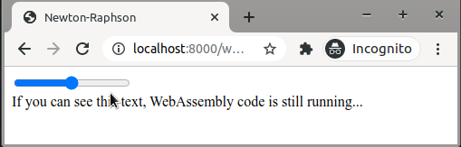

_By [Stefan Verhoeven](https://orcid.org/0000-0002-5821-2060), [Christiaan Meijer](https://orcid.org/0000-0002-5529-5761), [Faruk Diblen](https://orcid.org/0000-0002-0989-929X),
[Jurriaan H. Spaaks](https://orcid.org/0000-0002-7064-4069), and [Adam Belloum](https://orcid.org/0000-0001-6306-6937)._

# Help! My C++ web app is not responding

In an [earlier blogpost](../webassembly/README.md) we discussed how to run C++ code on the web using JavaScript. We
created a web app that executed some C++ code and then showed the result in the browser. While the page was running the
C++ code, the page was blocked and unresponsive. This was not noticeable, because the computation done in the code was
very quick. An unresponsive User Interface (UI) becomes a problem when we are performing tasks that take a bit longer to
run.

_How to prevent blocking when running long running tasks in C++?_

In this blog post, we will use web workers to solve this problem by offloading tasks to another thread.

## Long-running tasks with web worker

Let's have a look at the code we ended up with in the [first blog](../webassembly/README.md) of the series. When loading
the page, the WebAssembly code is executed, after which the page can finish rendering. Because the WebAssembly code was
very quick, this was fine. For the current blog, we assume we have a longer running task. We create such a task
artificially, by adding a few seconds of `sleep` in the [C++ code](https://github.com/NLESC-JCER/run-cpp-on-web/blob/master/web-worker/newtonraphson.cpp). Like in the first post of the series, we compile the C++ code to create WebAssembly code. The
example page with our slow task can be found [here](https://nlesc-jcer.github.io/run-cpp-on-web/web-worker/example-blocking.html).

Notice that we also added a slider to the page. This slider simply serves to illustrate UI unresponsiveness--it has no attached
function. Notice that while the WebAssembly code is still running, the slider is completely blocked. If this was an
actual web app and not just a demo, the blocked UI would surely annoy users and possibly make working with the app
cumbersome and impractical. We can easily solve this, and keep the UI responsive at all times, using web workers.



_Blocked UI while code is running._

## Web workers

A [web worker](https://developer.mozilla.org/en-US/docs/Web/API/Web_Workers_API) is an object that handles execution of
a piece of code in another thread.

The way the page communicates with the worker object is through sending messages. The page will send a message to the
worker to start doing work, and the message will include all data that the worker needs. The worker then starts
executing the task, using only the data that was in the message. When finished, the worker needs to communicate the
results back to the web app. It will do this by sending a message, so the web app knows when to update.

## The resulting page

The code snippet below shows the web page that uses a web worker. Notice the creation of the `Worker` object, posting of the
message, as well as the instructions for handling of any returned messages containing results.

```html
<!doctype html>
<html lang="en">
  <head>
    <title>Web worker example</title>
    <script>
      const worker = new Worker('worker.js');
      worker.postMessage({
        type: 'CALCULATE',
        payload: { tolerance: 0.001, initial_guess: -4.0 }
      });
      worker.onmessage = function(message) {
        if (message.data.type === 'RESULT') {
          const root = message.data.payload.root;
          document.getElementById('answer').innerHTML =
            "Function root is approximately at x = " + root.toFixed(2);
        }
      }
    </script>
  </head>
  <body>
    <div class="slidecontainer">
      <input type="range" min="1" max="100" value="50" class="slider" id="myRange">
    </div>
    <span id="answer"> </span>
  </body>
</html>
```

The web worker code only contains handling of the incoming message. The web worker unpacks the
message, does the root finding calculation, and packs the results in a new message that it will send back.

The code for the worker in `worker.js` is:

```js
importScripts('newtonraphson.js');

onmessage = function(message) {
  if (message.data.type === 'CALCULATE') {
    createModule().then(({NewtonRaphson}) => {
      const tolerance = message.data.payload.tolerance;
      const finder = new NewtonRaphson(tolerance);
      const initial_guess = message.data.payload.initial_guess;
      const root = finder.solve(initial_guess);
      postMessage({
        type: 'RESULT',
        payload: {
          root: root
        }
      });
    });
  }
};
```

The figure below illustrates what is happening in parallel in the two threads.


We can see the code in action
[here](https://nlesc-jcer.github.io/run-cpp-on-web/web-worker/example-web-worker.html). The calculation still takes
the same time to perform, but as you will notice, the slider remains responsive.


_Responsive UI thanks to offloading the root finding procedure to the web worker._

## Recap and what next?

In this blog post, we learned how to keep a web app from freezing while executing computationally intensive C++
code. We learned how to create a web worker and how to use the web worker in a simple web app.

Now you can take this web app a step further by reading some of the other blogs in this series, for example [how to interact with your app using forms](../react/README.md) and [how to spice up your app up with
visualizations](../vega/README.md). A final blog shows you [how to combine all of the above in a single web app](../kitchen-sink/README.md).

Looking for the first blog and introduction to this series? [This blog post](../webassembly/README.md) will show you how
to get started running your C++ on the web using webassembly.

## Get in touch with us


This blog was written by the Generalization Team of the Netherlands eScience Center.  The team consists of Stefan Verhoeven,
Faruk Diblen, Jurriaan H. Spaaks, Adam Belloum and Christiaan Meijer. Feel free to get in touch with the generalization
team at generalization@esciencecenter.nl.

_These blogs were written as part of the "Passing XSAMS" project. To learn more about the project, check out its
[project page](https://www.esciencecenter.nl/projects/passing-xsams/)._
